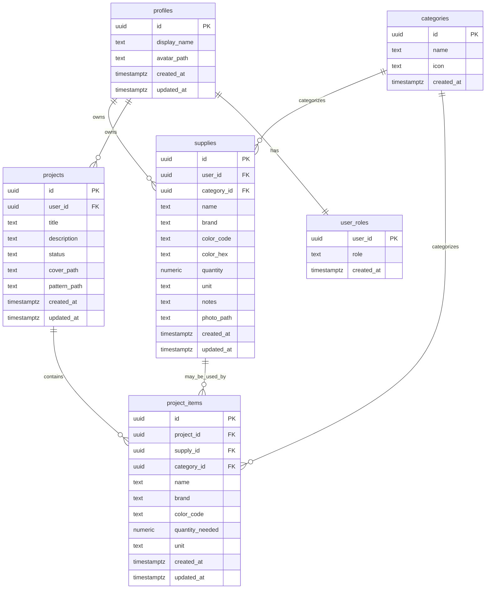

# Database schema

The application stores user data, inventory records, project information, and admin metadata in PostgreSQL through Supabase.

## Core tables

- `profiles`: one row per authenticated user
- `user_roles`: stores the default `user` or `admin` role
- `categories`: admin-managed item categories
- `supplies`: each user's owned inventory items
- `projects`: project records keyed to a user
- `project_items`: the materials listed for each project

## Important rules

- All tables in `public` use Row-Level Security.
- `supplies` and `projects` are owner-scoped by `user_id`.
- `project_items` can only be read or modified when the parent project belongs to the current user.
- `categories` are readable by authenticated users and writable only by admins.
- `user_roles` is admin-controlled; normal users can access only their own row.

## Supply photo storage

The private `supply-photos` bucket stores JPG, PNG, and WebP images up to 5 MB. Object names follow `{user_id}/{uuid}.{ext}` and the `supplies.photo_path` column stores the object path, not a URL. Authenticated users can access objects in their own folder; admins can access objects for authorized moderation. The client creates expiring signed URLs when rendering private photos. Bucket configuration and object policies are managed by `supabase/migrations/20261010101407_add_supply_photos_storage.sql`.

The private `project-files` bucket stores project cover images (JPG/PNG/WebP, up to 5 MB) and pattern images or PDFs (JPG/PNG/WebP/PDF, up to 10 MB). Project object paths follow `{user_id}/{project_id}/{kind}/{uuid}.{ext}`; `projects.cover_path` and `projects.pattern_path` store paths, never URLs. Authenticated users can access files in their own user folder, and admins can access files for authorized moderation. The client creates expiring signed URLs for display. Bucket configuration and object policies are managed by `supabase/migrations/20261010104047_add_project_files_storage.sql`.

## Entity relationships

## Security helper

The database includes a `public.is_admin()` helper that checks whether the current user has the `admin` role. This helper is used inside Row-Level Security policies to keep administrative actions server-side and predictable.
