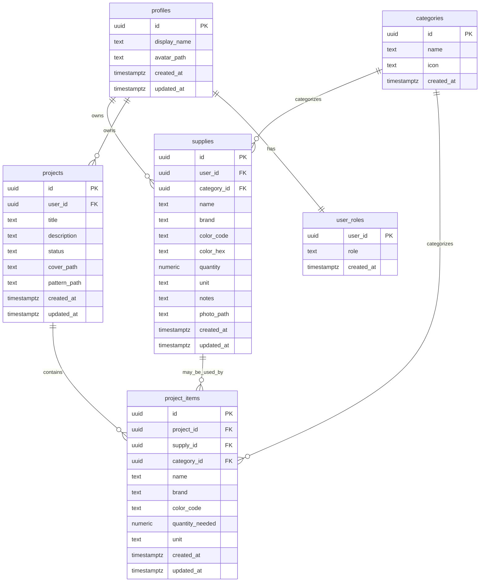

# Database schema

The application stores user data, inventory records, project information, and admin metadata in PostgreSQL through Supabase.

## Core tables

- `profiles`: one row per authenticated user
- `user_roles`: stores the default `user` or `admin` role
- `categories`: admin-managed item categories
- `supplies`: each user's owned inventory items
- `projects`: project records keyed to a user
- `project_items`: the materials listed for each project

## Important rules

- All tables in `public` use Row-Level Security.
- `supplies` and `projects` are owner-scoped by `user_id`.
- `project_items` can only be read or modified when the parent project belongs to the current user.
- A non-null `project_items.supply_id` must refer to inventory owned by the parent project's owner; one owned supply can be linked once per project.
- `categories` are readable by authenticated users and writable only by admins.
- `user_roles` is admin-controlled; normal users can access only their own row.
- Client roles cannot directly insert, update, or delete `user_roles`; `admin_list_users()` and `admin_set_user_role(uuid, text)` are authenticated-only, admin-checked RPCs. Role changes are serialized and the final administrator cannot be demoted.

## Initial administrator bootstrap

New accounts always receive the `user` role. Promote the first administrator using the trusted Supabase SQL Editor as the project owner: find the intended account UUID in Authentication > Users, then replace the placeholder below with that UUID:

```sql
UPDATE public.user_roles
SET role = 'admin'
WHERE user_id = '<auth-user-uuid>'::uuid;
```

Verify exactly one row was updated. This bootstrap step must never be exposed through the browser client or an unauthenticated endpoint. After an administrator exists, manage roles from the admin panel; its RPC rejects unauthenticated/non-admin callers and prevents demoting the last administrator. Migration `20261010160000_secure_admin_operations.sql` removes direct client role-write policies.

The same migration defines `admin_list_users()` for administrator-only account listing (including auth email) and `admin_set_user_role(uuid, text)` for serialized role changes. The functions run as security definer, use a fixed search path, and have execute permission only for `authenticated`; their bodies check `public.is_admin()`.

## Supply photo storage

The private `supply-photos` bucket stores JPG, PNG, and WebP images up to 5 MB. Object names follow `{user_id}/{uuid}.{ext}` and the `supplies.photo_path` column stores the object path, not a URL. Authenticated users can access objects in their own folder; admins can access objects for authorized moderation. The client creates expiring signed URLs when rendering private photos. Bucket configuration and object policies are managed by `supabase/migrations/20261010101407_add_supply_photos_storage.sql`.

The private `project-files` bucket stores project cover images (JPG/PNG/WebP, up to 5 MB) and pattern images or PDFs (JPG/PNG/WebP/PDF, up to 10 MB). Project object paths follow `{user_id}/{project_id}/{kind}/{uuid}.{ext}`; `projects.cover_path` and `projects.pattern_path` store paths, never URLs. Authenticated users can access files in their own user folder, and admins can access files for authorized moderation. The client creates expiring signed URLs for display. Bucket configuration and object policies are managed by `supabase/migrations/20261010104047_add_project_files_storage.sql`.

The private `avatars` bucket stores JPG, PNG, and WebP profile photos up to 5 MB. Object names follow `{user_id}/{uuid}.{ext}` and `profiles.avatar_path` stores the path rather than a URL. Authenticated users and admins can access objects according to the user-folder policy; the client creates expiring signed URLs for display. Bucket configuration and policies are defined in `supabase/migrations/20261010153000_add_private_avatars_storage.sql`.

For project supply tracking, `project_items.supply_id` links an item need to the project owner's inventory; otherwise the item remains a shopping need. `src/services/projectItemsService.js` computes owned, partial, and missing states, comparing quantities only when both units are specified and match case-insensitively. A unit mismatch is treated as fully missing until corrected. Migration `20261010142000_secure_project_items.sql` enforces owner-matched links and prevents duplicate links to the same supply within a project. Migration `20261010143500_mark_project_items_purchased.sql` adds `public.mark_project_item_purchased(uuid)`, which creates and links inventory for an unlinked need or adds only the current shortfall to linked stock in one transaction. Row locks prevent concurrent/repeated purchase requests from double-incrementing inventory. Migration `20261010150000_revoke_anon_project_purchase.sql` removes Supabase's default anonymous function grant and permits execution only for authenticated callers.

## Entity relationships



## Security helper

The database includes a `public.is_admin()` helper that checks whether the current user has the `admin` role. This helper is used inside Row-Level Security policies to keep administrative actions server-side and predictable.
